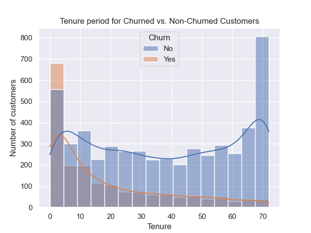
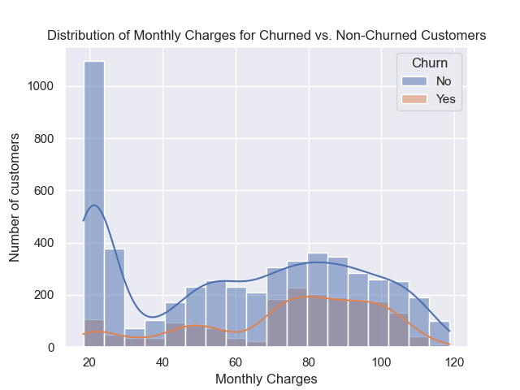
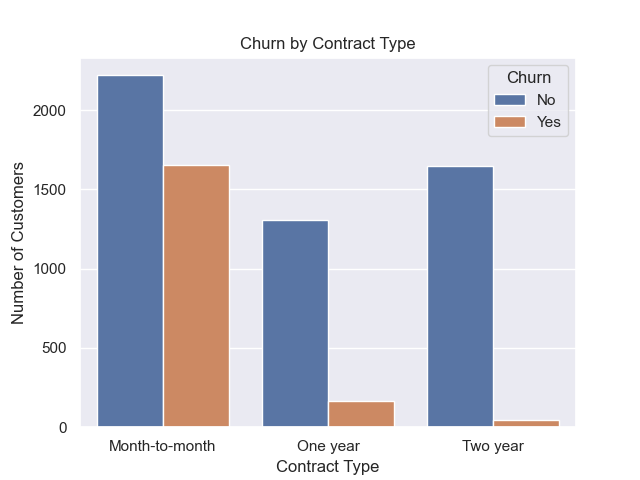
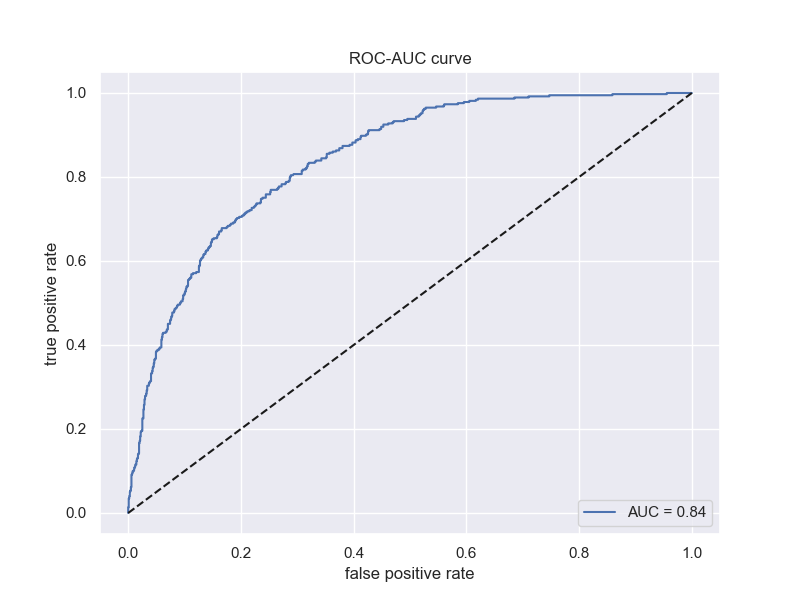

# Customer Churn Prediction
A machine learning model to predict and prevent customer churn.

## Project Overview
This project aims to build a predictive model to identify customers at risk of churning from a telecommunications service. The goal is to provide a list of high-risk customers that a business can target with retention offers.

## Data analysis
Initial analysis of the dataset revealed several key factors influencing churn:
1.High churn among new customers: Customers with a short tenure (less than 12 months) were far more likely to churn.

2.Monthly charges:Customers with higher monthly bills had a greater probability of churning.

3.Contract type:Customers on a month-to-month contract had the highest churn rate compared to those with one- and two-year contracts.

## Methodology
The project followed a standard machine learning workflow:
1.Data preprocessing:Handled missing values in the TotalCharges column by filling them with 0. The Churn column was mapped to 0 and 1, and all categorical features were one-hot encoded.
2.Addressing imbalance: Since the dataset was imbalanced, the SMOTE technique was used on the training data to create a balanced dataset for model training.
3.Model selection & tuning: A Logistic Regression model was chosen and GridSearchCV was used to find the optimal hyperparameters for the model, ensuring the highest performance.

## Results and conclusion
The final model achieved a strong performance on the imbalanced dataset. While the overall accuracy was decent, the primary goal was to improve recall for the minority churn class.The final model achieved a recall of 0.73, meaning it correctly identified 73% of customers who would actually churn.
This model provides a clear,prioritized list of customers that a business can target to save revenue and improve customer loyalty.
The ROC-AUC Curve:
To provide a comprehensive evaluation of the model, its performance was also assessed using the ROC-AUC curve. This plot visualizes the model's ability to distinguish between the two classes at all possible classification thresholds.
The final model achieved an AUC score of 0.84, which is a strong result.
This score confirms that the model is significantly better than a random guess i.e., 0.50 and is a robust and reliable tool for identifying customers at risk of churning.

## App Deployment
This model has been deployed as a simple web application using "Streamlit Community Cloud".
This demonstrates the end-to-end capability of this project, turning the predictive model into a practical tool for business use.
